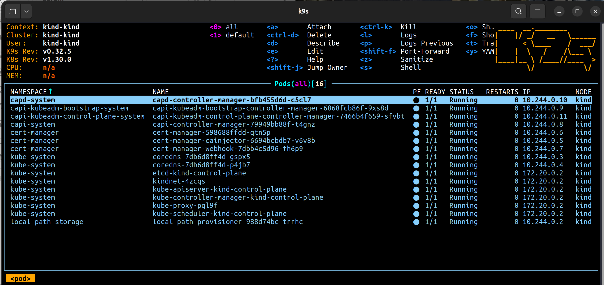
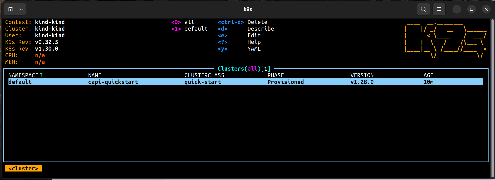
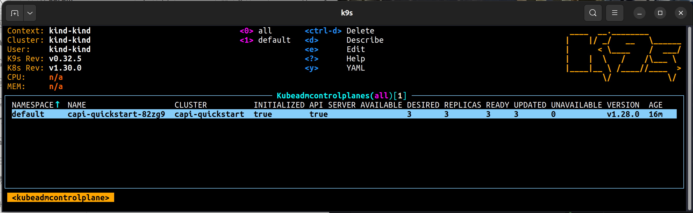

# capi-demo

```
> kind --version
kind version 0.23.0

> cat > kind-cluster-with-extramounts.yaml <<EOF
kind: Cluster
apiVersion: kind.x-k8s.io/v1alpha4
nodes:
- role: control-plane
  extraMounts:
    - hostPath: /var/run/docker.sock
      containerPath: /var/run/docker.sock
EOF

> kind --version
kind version 0.23.0

> kind create cluster --config kind-cluster-with-extramounts.yaml
Creating cluster "kind" ...
 ✓ Ensuring node image (kindest/node:v1.30.0) 🖼 
 ✓ Preparing nodes 📦  
 ✓ Writing configuration 📜 
 ✓ Starting control-plane 🕹️ 
 ✓ Installing CNI 🔌 
 ✓ Installing StorageClass 💾 
Set kubectl context to "kind-kind"
You can now use your cluster with:

kubectl cluster-info --context kind-kind

> kubectl cluster-info --context kind-kind

Kubernetes control plane is running at https://127.0.0.1:41607
CoreDNS is running at https://127.0.0.1:41607/api/v1/namespaces/kube-system/services/kube-dns:dns/proxy

To further debug and diagnose cluster problems, use 'kubectl cluster-info dump'.

> kgpa
NAMESPACE            NAME                                         READY   STATUS    RESTARTS   AGE
kube-system          coredns-7db6d8ff4d-gspx5                     1/1     Running   0          2m7s
kube-system          coredns-7db6d8ff4d-p4jb7                     1/1     Running   0          2m7s
kube-system          etcd-kind-control-plane                      1/1     Running   0          2m22s
kube-system          kindnet-4zcqs                                1/1     Running   0          2m7s
kube-system          kube-apiserver-kind-control-plane            1/1     Running   0          2m22s
kube-system          kube-controller-manager-kind-control-plane   1/1     Running   0          2m22s
kube-system          kube-proxy-pql9f                             1/1     Running   0          2m7s
kube-system          kube-scheduler-kind-control-plane            1/1     Running   0          2m22s
local-path-storage   local-path-provisioner-988d74bc-trrhc        1/1     Running   0          2m7s

> curl -L https://github.com/kubernetes-sigs/cluster-api/releases/download/v1.1.6/clusterctl-linux-amd64 -o clusterctl

  % Total    % Received % Xferd  Average Speed   Time    Time     Time  Current
                                 Dload  Upload   Total   Spent    Left  Speed
  0     0    0     0    0     0      0      0 --:--:-- --:--:-- --:--:--     0
100 59.6M  100 59.6M    0     0  34.1M      0  0:00:01  0:00:01 --:--:-- 74.5M
> chmod +x ./clusterctl

> sudo mv ./clusterctl /usr/local/bin/clusterctl

[sudo] password for mdbdba: 
> clusterctl version

clusterctl version: &version.Info{Major:"1", Minor:"1", GitVersion:"v1.1.6", GitCommit:"be018747e8f3416fa8b67fb14ff999706ac36217", GitTreeState:"clean", BuildDate:"2022-09-14T09:08:08Z", GoVersion:"go1.17.3", Compiler:"gc", Platform:"linux/amd64"}

# Enable the experimental Cluster topology feature.
> export CLUSTER_TOPOLOGY=true

# Initialize the management cluster
> clusterctl init --infrastructure docker
Fetching providers
Installing cert-manager Version="v1.7.2"
Waiting for cert-manager to be available...
Installing Provider="cluster-api" Version="v1.7.4" TargetNamespace="capi-system"
Installing Provider="bootstrap-kubeadm" Version="v1.7.4" TargetNamespace="capi-kubeadm-bootstrap-system"
Installing Provider="control-plane-kubeadm" Version="v1.7.4" TargetNamespace="capi-kubeadm-control-plane-system"
Installing Provider="infrastructure-docker" Version="v1.7.4" TargetNamespace="capd-system"

Your management cluster has been initialized successfully!

You can now create your first workload cluster by running the following:

  clusterctl generate cluster [name] --kubernetes-version [version] | kubectl apply -f -

# override the default "cluster.local"
> export SERVICE_DOMAIN="capi.demo"

> clusterctl generate cluster capi-quickstart --flavor development \
  --kubernetes-version v1.28.0 \
  --control-plane-machine-count=3 \
  --worker-machine-count=3 \
  > capi-quickstart.yaml

> kubectl apply -f capi-quickstart.yaml

clusterclass.cluster.x-k8s.io/quick-start created
dockerclustertemplate.infrastructure.cluster.x-k8s.io/quick-start-cluster created
kubeadmcontrolplanetemplate.controlplane.cluster.x-k8s.io/quick-start-control-plane created
dockermachinetemplate.infrastructure.cluster.x-k8s.io/quick-start-control-plane created
dockermachinetemplate.infrastructure.cluster.x-k8s.io/quick-start-default-worker-machinetemplate created
dockermachinepooltemplate.infrastructure.cluster.x-k8s.io/quick-start-default-worker-machinepooltemplate created
kubeadmconfigtemplate.bootstrap.cluster.x-k8s.io/quick-start-default-worker-bootstraptemplate created
cluster.cluster.x-k8s.io/capi-quickstart created

> k get cluster
NAME              CLUSTERCLASS   PHASE         AGE   VERSION
capi-quickstart   quick-start    Provisioned   49s   v1.28.0

> clusterctl describe cluster capi-quickstart

NAME                                                           READY  SEVERITY  REASON                       SINCE  MESSAGE                                                                                
Cluster/capi-quickstart                                        False  Warning   ScalingUp                    84s    Scaling up control plane to 3 replicas (actual 2)                                      
├─ClusterInfrastructure - DockerCluster/capi-quickstart-nr96w  True                                          2m37s                                                                                         
├─ControlPlane - KubeadmControlPlane/capi-quickstart-82zg9     False  Warning   ScalingUp                    84s    Scaling up control plane to 3 replicas (actual 2)                                      
│ ├─2 Machines...                                              True                                          109s   See capi-quickstart-82zg9-f47bq, capi-quickstart-82zg9-s24rb                           
│ └─Machine/capi-quickstart-82zg9-hphtv                        False  Info      Bootstrapping                21s    1 of 2 completed                                                                       
└─Workers                                                                                                                                                                                                  
  ├─MachineDeployment/capi-quickstart-md-0-2vbc5               False  Warning   WaitingForAvailableMachines  2m41s  Minimum availability requires 3 replicas, current 0 available                          
  │ └─3 Machines...                                            True                                          90s    See capi-quickstart-md-0-2vbc5-mgs4h-2nfxn, capi-quickstart-md-0-2vbc5-mgs4h-7pkpx, ...
  └─Other                                                                                                                                                                                                  
    ├─Machine/worker-9jzz4v                                    True                                          8s                                                                                            
    ├─Machine/worker-c92iww                                    True                                          5s                                                                                            
    └─Machine/worker-vpxr1m                                    True                                          5s                                      

> clusterctl get kubeconfig capi-quickstart > capi-quickstart.kubeconfig

> kubectl --kubeconfig=./capi-quickstart.kubeconfig \
  apply -f https://docs.projectcalico.org/v3.21/manifests/calico.yaml

configmap/calico-config created
customresourcedefinition.apiextensions.k8s.io/bgpconfigurations.crd.projectcalico.org created
customresourcedefinition.apiextensions.k8s.io/bgppeers.crd.projectcalico.org created
customresourcedefinition.apiextensions.k8s.io/blockaffinities.crd.projectcalico.org created
customresourcedefinition.apiextensions.k8s.io/caliconodestatuses.crd.projectcalico.org created
customresourcedefinition.apiextensions.k8s.io/clusterinformations.crd.projectcalico.org created
customresourcedefinition.apiextensions.k8s.io/felixconfigurations.crd.projectcalico.org created
customresourcedefinition.apiextensions.k8s.io/globalnetworkpolicies.crd.projectcalico.org created
customresourcedefinition.apiextensions.k8s.io/globalnetworksets.crd.projectcalico.org created
customresourcedefinition.apiextensions.k8s.io/hostendpoints.crd.projectcalico.org created
customresourcedefinition.apiextensions.k8s.io/ipamblocks.crd.projectcalico.org created
customresourcedefinition.apiextensions.k8s.io/ipamconfigs.crd.projectcalico.org created
customresourcedefinition.apiextensions.k8s.io/ipamhandles.crd.projectcalico.org created
customresourcedefinition.apiextensions.k8s.io/ippools.crd.projectcalico.org created
customresourcedefinition.apiextensions.k8s.io/ipreservations.crd.projectcalico.org created
customresourcedefinition.apiextensions.k8s.io/kubecontrollersconfigurations.crd.projectcalico.org created
customresourcedefinition.apiextensions.k8s.io/networkpolicies.crd.projectcalico.org created
customresourcedefinition.apiextensions.k8s.io/networksets.crd.projectcalico.org created
clusterrole.rbac.authorization.k8s.io/calico-kube-controllers created
clusterrolebinding.rbac.authorization.k8s.io/calico-kube-controllers created
clusterrole.rbac.authorization.k8s.io/calico-node created
clusterrolebinding.rbac.authorization.k8s.io/calico-node created
daemonset.apps/calico-node created
serviceaccount/calico-node created
deployment.apps/calico-kube-controllers created
serviceaccount/calico-kube-controllers created
error: resource mapping not found for name: "calico-kube-controllers" namespace: "kube-system" from "https://docs.projectcalico.org/v3.21/manifests/calico.yaml": no matches for kind "PodDisruptionBudget" in version "policy/v1beta1"
ensure CRDs are installed first

> kubectl --kubeconfig=./capi-quickstart.kubeconfig get nodes

NAME                                     STATUS   ROLES           AGE     VERSION
capi-quickstart-82zg9-f47bq              Ready    control-plane   5m25s   v1.28.0
capi-quickstart-82zg9-hphtv              Ready    control-plane   4m17s   v1.28.0
capi-quickstart-82zg9-s24rb              Ready    control-plane   6m9s    v1.28.0
capi-quickstart-md-0-2vbc5-mgs4h-2nfxn   Ready    <none>          5m48s   v1.28.0
capi-quickstart-md-0-2vbc5-mgs4h-7pkpx   Ready    <none>          4m27s   v1.28.0
capi-quickstart-md-0-2vbc5-mgs4h-s92db   Ready    <none>          4m25s   v1.28.0
capi-quickstart-worker-9jzz4v            Ready    <none>          4m27s   v1.28.0
capi-quickstart-worker-c92iww            Ready    <none>          4m25s   v1.28.0
capi-quickstart-worker-vpxr1m            Ready    <none>          4m25s   v1.28.0

> kubectl get kubeadmcontrolplane

NAME                    CLUSTER           INITIALIZED   API SERVER AVAILABLE   REPLICAS   READY   UPDATED   UNAVAILABLE   AGE     VERSION
capi-quickstart-82zg9   capi-quickstart   true          true                   3          3       3         0             7m15s   v1.28.0

```

Using k9s check clusters and kubeadmcontrolplane

Pods on the control cluster


List the clusters the capi knows about


Check the status of those clusters



To clean up:
```
> kubectl delete cluster capi-quickstart

cluster.cluster.x-k8s.io "capi-quickstart" deleted
> kind delete cluster

Deleting cluster "kind" ...
Deleted nodes: ["kind-control-plane"]

```

